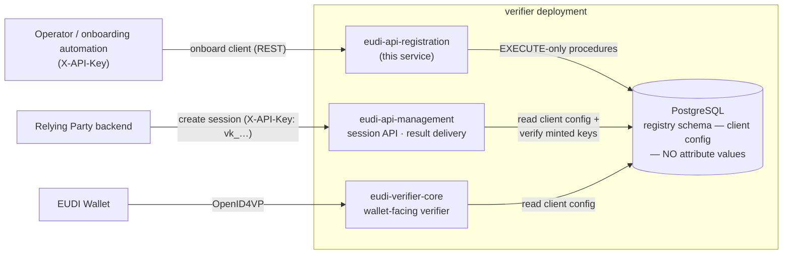
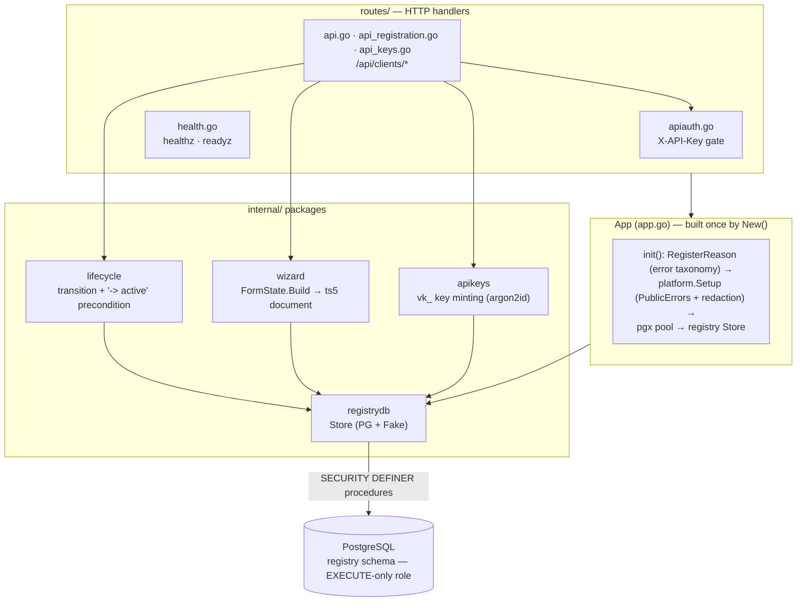
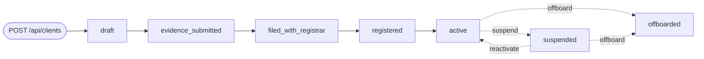

# eudi-api-registration

The **onboarding control plane** of an EU Digital Identity Wallet **Relying Party (Verifier)** — a pure, headless, `X-API-Key`-authenticated admin API over the shared `registry` schema. It creates and lists clients, records their Relying Party registration document, drives each client through its lifecycle state machine, sets the webhook URL that result delivery uses, records the web origins a client may be invoked from, and mints the verification API keys a client later presents to the runtime session API. That is the whole job.

It is deliberately small: **no HTML, no operator login, no client-facing UI, no sessions, no CSRF, no key/value store, no background jobs.** Onboarding a Relying Party is 100% API calls — every route is machine-to-machine. eudi-api-registration is **never in the request path of a live verification**; it only prepares the registry data that the wallet-facing and session services read at runtime.

---

## Where it sits

eudi-api-registration is one service in a small set, and the only one an operator (or onboarding automation) talks to. It writes client configuration and registration data into a shared PostgreSQL `registry` schema; the runtime services read that same schema. It shares nothing else with its siblings — no cache, no queue, no in-process coupling.



Division of labour: eudi-api-registration owns the **control plane** — client CRUD, the registration document, lifecycle transitions, and verification-key minting. eudi-api-management owns the **runtime session API** and result delivery (client polling plus optional webhooks). eudi-verifier-core owns everything the **wallet** touches. The three meet only at the shared `registry` schema: eudi-api-registration writes it, the other two read it.

---

## HTTP surface

Every `/api/*` route requires `X-API-Key: <ADMIN_API_KEY>`, constant-time-compared ([`routes/apiauth.go`](routes/apiauth.go)); a missing, empty, or wrong key is an **indistinguishable `401`** — no oracle on *why* it failed. The gate is **unconditional**: `ADMIN_API_KEY` is required at boot, so there is no unguarded mode (fail closed). Errors render as the standard problem envelope (`err:domain:reason`).

| Method + path | Purpose | Notes |
|---|---|---|
| `GET /healthz` | Liveness | 200 whenever the process is up; no dependency probing |
| `GET /readyz` | Readiness (fail-closed) | 503 `degraded` if PostgreSQL is unreachable (2 s probe); this service has no other dependency |
| `GET /api/clients` | List client summaries | `?state=` filters to a single lifecycle state |
| `POST /api/clients` | Create a draft client | Body `{name, contactEmail?}` → 201 `{id, slug, state}` (`state` is always `draft`) |
| `GET /api/clients/{id}` | Full client detail | Includes the stored registration document (or `null` if none has been submitted) and the registrar identity as `registryUri` / `clientIdentifier` — empty strings until it has been set |
| `PUT /api/clients/{id}/registrar-identity` | Set the registrar-assigned identity | Body `{registryUri, clientIdentifier}` — both required; `registryUri` must be an absolute `https` URL → 204 |
| `PUT /api/clients/{id}/registration` | Submit the registration document | Structured DTO → assembled + validated → stored (full replace) → 200 `{id, state, intendedUses}` |
| `POST /api/clients/{id}/transition` | Drive one lifecycle edge | Body `{targetState, reason?, evidenceRef?}` → 200 `{id, state}` |
| `PUT /api/clients/{id}/webhook` | Set the client's default webhook URL | Body `{webhookUrl}` — absolute `https` → 200 `{id, state, webhookUrl}` |
| `PUT /api/clients/{id}/allowed-origins` | Set the web origins the client may be invoked from | Body `{allowedOrigins}` — each `https://host[:port]` and nothing else; the list is **replaced**, and `[]` withdraws every origin → 200 `{id, state, allowedOrigins}` |
| `PUT /api/clients/{id}/dcapi-request-mode` | Choose signed or unsigned browser-based presentation requests | Body `{dcapiRequestMode}` — `"signed"` or `"unsigned"`, nothing else and never omitted → 200 `{id, state, dcapiRequestMode}` |
| `POST /api/clients/{id}/keys` | Mint a verification API key | → 201 `{clientId, prefix, apiKey}`; `apiKey` is shown **exactly once**, only its hash is persisted |

**About the browser-request mode.** A signed request lets the wallet authenticate the relying party through its certificate chain and registration data, on top of the web origin the browser asserts; an unsigned one offers that origin as the only identity. This endpoint chooses between them **for one client, within what the deployment already permits** — the presentation service carries its own deployment-wide setting, and one restricted to signed requests keeps issuing signed ones for a client recorded as unsigned. So this can narrow a client inside a deployment, never widen the deployment. A client nobody has decided about is signed: absence is read as the mode that lets the wallet authenticate us. The choice is recorded even when it matches that default, so "deliberately signed" and "never decided" stay distinguishable, and it is merged into the client's policy without disturbing the other verification choices stored beside it.

Representative problem codes: `err:api:invalid-body` (400, malformed JSON or a missing required field), `err:api:registration-invalid` (422, the assembled document failed validation), `err:registry:illegal-transition` (409, an illegal lifecycle edge), `err:client:intended-use-required` (422, `-> active` with no non-revoked intended use), `err:client:registrar-identity-required` (422, `-> active` with no recorded registrar identity), and `err:registry:not-found` (404, unknown client id). Each is surfaced verbatim from the layer that owns it.

---

## Architecture

One Azugo application object (`App` in [`app.go`](app.go)) wires every dependency at startup with a public error boundary (`PublicErrors: true`) and **fails closed** on misconfiguration — a missing `ADMIN_API_KEY` or `POSTGRES_DSN` stops the process from starting. The dependency graph is intentionally shallow: config, a PostgreSQL pool, and the registry store bridge. Nothing else.



---

## Client lifecycle

Every client moves through a fixed lifecycle state machine. `POST /api/clients/{id}/transition` drives **exactly one edge per call**. The set of legal edges is enforced **entirely** by the `registry.transition_client` stored procedure (mirrored in the in-memory test fake) — this service never re-implements the matrix; it calls the procedure and surfaces its verdict (`err:registry:illegal-transition`, 409).



Two service-level rules layer on top of the store's matrix ([`internal/lifecycle`](internal/lifecycle/)) — both **add** checks, neither loosens the store's own verdict:

- **`-> active` requires a recorded registrar identity (an absolute `https` registrar URL and the identifier it assigned — `PUT /api/clients/{id}/registrar-identity`) and at least one non-revoked intended use** (and passes a placeholder ARF TS5 re-verification seam, permissive by default until a live registrar check exists). The precondition runs only for the edge's two legal predecessors (`registered`, `suspended`); any other current state falls straight through to the store's own illegal-transition error, so a client with zero intended uses in an illegal predecessor state gets the correct 409, not a misleading 422.
- **`-> offboarded` is idempotent** — retrying offboard on an already-offboarded client re-runs the idempotent purge (revoke keys, purge evidence content per retention) instead of hitting the illegal self-transition edge.

---

## Registration documents

`PUT /api/clients/{id}/registration` accepts a self-contained structured JSON DTO and assembles it into a `ts5.WalletRelyingParty` document — the Relying Party registration data set defined by **ARF TS5 / ARF TS6** and **CIR 2025/848 Annex I** — plus the scope-projection rows the session service reads at verification time ([`internal/wizard`](internal/wizard/)).

The wire DTO is a **deliberate contract type**, decoupled from the underlying `ts5` model so the contract can evolve independently of the storage shape. All assembly and validation — legal identity, identifiers, country code, credential formats and claim paths, intended uses, supervisory-authority contact — live in exactly one place (`FormState.Build`); the handler adds no validation of its own beyond "is this valid JSON". A save **replaces** any previously stored document and its intended-use set in full (never a partial merge). Unknown credential formats are rejected outright rather than silently passed through.

---

## Verification API keys

`POST /api/clients/{id}/keys` mints a **verification API key** for a client: a display key of the form `vk_<prefix>_<secret>`, returned to the caller exactly once, plus an argon2id PHC hash that is the **only** part persisted ([`internal/apikeys`](internal/apikeys/)). The client hands this key to the runtime session API and presents it at verification time — eudi-api-registration itself **never verifies** a presented key, so it holds only the minting half (no parse/verify).

The minting format — key scheme prefix, argon2id parameters (`m=19 MiB, t=2, p=1`), and encodings — mirrors the session service's own key logic and **must stay in lockstep with it**: a format drift on either side would make a key minted here unverifiable there. This surface has **no list or revoke** operation; repeated calls simply mint additional keys. The full key is never logged and never reaches the database.

---

## Call-order example

Create a client, register it, walk it through the lifecycle, mint its key, then use that key against the session API directly (eudi-api-registration is never in the verification path):

```bash
BASE=http://localhost:8080
KEY=$ADMIN_API_KEY

# 1. Create a draft client
ID=$(curl -s -X POST "$BASE/api/clients" -H "X-API-Key: $KEY" \
  -H 'content-type: application/json' \
  -d '{"name":"Acme RP","contactEmail":"ops@acme.example"}' | jq -r .id)

# 2. Submit its registration (WalletRelyingParty) document
curl -s -X PUT "$BASE/api/clients/$ID/registration" -H "X-API-Key: $KEY" \
  -H 'content-type: application/json' -d @registration.json

# 3. Drive the lifecycle forward one edge per call, recording the
#    registrar-assigned identity after filing (learned from the registrar
#    at that point).
for state in evidence_submitted filed_with_registrar; do
  curl -s -X POST "$BASE/api/clients/$ID/transition" -H "X-API-Key: $KEY" \
    -H 'content-type: application/json' -d "{\"targetState\":\"$state\"}"
done
curl -s -X PUT "$BASE/api/clients/$ID/registrar-identity" -H "X-API-Key: $KEY" \
  -H 'content-type: application/json' \
  -d '{"registryUri":"https://registrar.example/ts5","clientIdentifier":"RP-000123"}'
for state in registered active; do
  curl -s -X POST "$BASE/api/clients/$ID/transition" -H "X-API-Key: $KEY" \
    -H 'content-type: application/json' -d "{\"targetState\":\"$state\"}"
done

# 4. Mint the client's verification key — shown once, capture it now
curl -s -X POST "$BASE/api/clients/$ID/keys" -H "X-API-Key: $KEY"
# -> 201 {"clientId":"...","prefix":"...","apiKey":"vk_<prefix>_<secret>"}

# 5. Hand that apiKey to the client; THEY use it against the session API,
#    not this service.
```

---

## State and data model

eudi-api-registration owns **no schema of its own**. It reads and writes the shared `registry` schema **exclusively through `SECURITY DEFINER` stored procedures**, connecting as an EXECUTE-only PostgreSQL role (`registration_api_public`) that holds no direct table or sequence grants — every access is a procedure call, never raw table SQL ([`internal/registrydb`](internal/registrydb/)). The store exposes a single `Store` interface with a production pgx-backed implementation and an in-memory fake for tests.

**No wallet attribute value is ever persisted.** The registry holds client configuration, legal-entity registration data, lifecycle state, audit entries, and API-key **hashes** only — never a disclosed claim value.

---

## Configuration

Standard fleet env (`SERVER_URLS`, `SERVICE_NAME`, `ENVIRONMENT`, `LOG_*`, `METRICS_ENABLED`, `OTEL_*`, `RATELIMIT_*`) comes from the shared base configuration, plus exactly two service-specific fields ([`config.go`](config.go)) — **no key/value store URL, no OIDC, no signing keys, no feature flags**:

| Env var | Default | Meaning |
|---|---|---|
| `POSTGRES_DSN` | — (required) | PostgreSQL DSN; connects as the EXECUTE-only `registration_api_public` role. Secret: supports the `POSTGRES_DSN_FILE` secret-file convention (an explicit plain `POSTGRES_DSN` still overrides it) |
| `ADMIN_API_KEY` | — (required) | The `X-API-Key` value `/api/*` constant-time-compares against. Required at boot — the service refuses to start without it (fail closed). Supports the `ADMIN_API_KEY_FILE` secret-file convention (an explicit plain `ADMIN_API_KEY` still overrides it) |

---

## Security invariants

- **No attribute value in logs, traces, metrics, or error messages** (ARF AS-RP-01-002 / GDPR data minimisation). `RedactionPolicy()` ([`redaction.go`](redaction.go)) extends the fleet default (additive-only) with a standing credential-PII drop set; extend it **before** logging any new struct. This service handles client configuration rather than presented attributes, but the guard is kept in place for any future handler.
- **Fail closed on the API key** — `ADMIN_API_KEY` is required at boot; there is no `API_ENABLED` flag and no unguarded mode.
- **Indistinguishable 401** — the `X-API-Key` check is constant-time and reveals nothing about why it failed. The middleware logs nothing, so the key value can never leak.
- **EXECUTE-only database role** — every registry access goes through a `SECURITY DEFINER` procedure; the service role has no direct table grants, so cross-client access returns `not-found` (no existence leak), never a distinguishable 403.
- **Untrusted-input parsers are fuzzed** — the registration-document decoder and the document assembler both carry fuzz targets and must not panic on malformed input.

---

## Directory layout

```
eudi-api-registration/
├── app.go, config.go, redaction.go, testing.go   — App container, config, redaction policy, test helpers
├── cmd/server/                                    — CLI entrypoint (web, health subcommands)
├── routes/                                         — HTTP handlers
│   ├── apiauth.go       — X-API-Key gate (constant-time, indistinguishable 401)
│   ├── api.go           — list / create / get / transition / webhook / registrar-identity
│   ├── api_registration.go — structured registration DTO → document assembly
│   ├── api_keys.go      — verification-key minting
│   ├── health.go        — healthz · readyz
│   └── router.go        — route registration
└── internal/
    ├── registrydb/      — registry-schema Store (SECURITY DEFINER procedures; PG + in-memory Fake)
    ├── lifecycle/       — transition wrapper + "-> active" precondition + idempotent offboard
    ├── wizard/          — FormState.Build → ts5.WalletRelyingParty + scope projection
    └── apikeys/         — verification-key minting (vk_ scheme + argon2id, mint-only)
```

---

## Development

`testing.go` is `//go:build testhelpers`-gated so the production binary's dependency closure excludes test-only fixtures. **Any** command that touches `_test.go` files must carry the tag — always use the Makefile targets, never bare `go test`:

```bash
cd eudi-api-registration
make build        # prod build — no tag; matches the Dockerfile + shipped binary
make test         # go test -tags testhelpers -race ./...   (CI: cgo available)
make test-fast    # same, no -race (local dev without cgo)
make vet          # go vet -tags testhelpers ./...   (vet type-checks _test.go too)
make lint         # golangci-lint run --build-tags testhelpers

# Fuzz the untrusted-input parsers:
go test -tags testhelpers -run '^$' -fuzz '^FuzzParseRegistration$' -fuzztime 30s ./routes/
go test -tags testhelpers -run '^$' -fuzz '^FuzzWizardWRPAssembly$' -fuzztime 30s ./internal/wizard/
```

The unit suite runs entirely against in-process fakes — an in-memory `registrydb.Fake` stands in for PostgreSQL, so there is no Docker or network dependency. `NewTestApp` builds a fully wired `App` with the fake store already installed.

Docker: `docker build -f Dockerfile .` from this directory — multi-stage, distroless, non-root, `CGO_ENABLED=0`, digest-pinned base images.

---

## Notes and limitations

- **Mint-only key surface** — there is no list or revoke of minted verification keys here; repeated `POST .../keys` calls just mint more.
- **The lifecycle matrix is owned by the database procedure**, not this service. eudi-api-registration surfaces the procedure's verdict but does not define which edges are legal.
- **The `-> active` ARF TS5 re-verification seam is permissive** — it always passes today, pending a live registrar check. The intended-use precondition is enforced.

## License

EUPL-1.2 — see [`LICENSE`](LICENSE).
